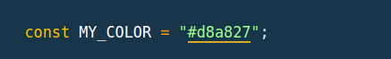
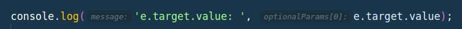

## Example Project Using VSCODE Extensions

This is an example repository only, an example which will 100% crash if "npm start"ed. so don't

It exists mainly and only for this readme.

> Notice the [snippets.md](snippets.md) file for vscode user configured snippets

- [הנחות יסוד](#הנחות-יסוד) <br/>
- [Extensions List](#extensions-list): <br/>
  - [IntelliCode](#intellicode)
  - [Code Spell Checker](#code-spell-checker)
  - [TabOut](#tabout)
  - [To](#to)
  - [GitLens](#gitlens)
  - [Git Graph](#git-graph)
  - [GitHub Pull Requests and Issues](#github-pull-requests-and-issues)
  - [File Utils](#file-utils)
  - [javascript console utils](#javascript-console-utils)
  - [Auto Add Brackets in String Interpolation](#auto-add-brackets-in-string-interpolation)
  - [Auto rename tag](#auto-rename-tag)
  - [ES7 React/.../React-Native Snippet](#es7-reactreact-native-snippet)
  - [Better comments](#better-comments)
  - [Color Highlight](#color-highlight)
  - [Indent rainbow](#indent-rainbow)
  - [Bookmarks](#bookmarks)
  - [Split HTML attributes](#split-html-attributes)
  - [Copy Relative Path and Line Numbers](#copy-relative-path-and-line-numbers)
  - [Bracket Peek ](#bracket-peek)
  - [Svg Preview](#svg-preview)
  - [Theme by language](#theme-by-language)
  - [CSS peak](#css-peak)
  - [Inline Parameters for VSCode](#inline-parameters-for-vscode)
  - [Paste JSON as Code](#paste-json-as-code)
  - [Color Assist](#color-assist)
  - [JSON Trailing Comma Trimmer](#json-trailing-comma-trimmer)
  - [Bracketeer](#bracketeer)
  - [Azure Databases (for MongoDB)](#azure-databases-for-mongodb)


## הנחות יסוד
- The command pallette (opened with `ctrl`+`shift`+`p`) has all commands (command that are bind to keyboard shortcuts and commands that are not)
- The extensions can be opened with `ctrl`+`shift`+`x`
- Intellisense is vs-code's completion menu that tries to complete your sentence (- your line of code)


## Extensions List:

> The names here are the exact names of the extensions in the vscode's extensions marketplace (`ctrl`+`shift`+`x` in vscode)


### IntelliCode
Comes from **Microsoft**. 

Adds intellisense which is created from data of millions of users. it guesses good...


---
### Code Spell Checker
Will add a curly underline sign on words that are not spelled correctly. Helps prevent "typo"s

VERY SUGGESTED

> (even for english speakers)

> I once wrote a short doc about a certain function, and at the end I noticed (thanks to this extension) that I mis-spelled the word "function" three times, in THREE different ways in one paragraph.

https://marketplace.visualstudio.com/items?itemName=streetsidesoftware.code-spell-checker

---
### TabOut

Use the `tab` key to get out of quotes, brackets, etc.

e.g if this: `|` is your cursor and you're here: `someFunc(value|)`. Without the extension, you need to press the `right-arrow` key. With the extension you would also be able to press the `tab` key. It's very intuitive once you try it (:

https://marketplace.visualstudio.com/items?itemName=albert.TabOut

---
### To
Convert any text to camelCase, to UPPER_CASE, to snake_case, to kebab-case and more

https://marketplace.visualstudio.com/items?itemName=amih90.to

--- 
### GitLens
Description: Supercharge Git within VS Code — Visualize code authorship at a glance via Git blame annotations and CodeLens, seamlessly navigate and explore Git repositories, gain valuable insights via rich visualizations and powerful comparison commands, and so much more

https://marketplace.visualstudio.com/items?itemName=eamodio.gitlens

--- 
### Git Graph
Adds a button at the bottom nav bar and on the Source Control top bar that opens the current git history (log) as a graph 

https://marketplace.visualstudio.com/items?itemName=mhutchie.git-graph


---
### GitHub Pull Requests and Issues
If  you go over Pull Requests in GitHub, this is a very suggested extension for PR review

https://marketplace.visualstudio.com/items?itemName=GitHub.vscode-pull-request-github

---
### File Utils
delete / rename / ... current file via the command pallette!


https://marketplace.visualstudio.com/items?itemName=sleistner.vscode-fileutils

---
### javascript console utils
Adds a keyboard shortcut (default to `ctrl` + `shift` + `l`) which writes: `console.log()`. 
And when a variable is selected, writes `console.log(“var: “, var);`.

> There are several console.log extensions, you're welcome to find the one you prefer.

> You can also checkout how to do this on you own, using vscode's user configured keybindings and snippets

https://marketplace.visualstudio.com/items?itemName=whtouche.vscode-js-console-utils

---

### Auto Add Brackets in String Interpolation
If you type a dollar sign (`$`) inside backtick brackets (` `` `) it will add the curly brackets for you

i.e ``` `typingHere` ``` -> writing a `$`: `$typingHere` -> will turn into ``` `${typingHere...}` ```

https://marketplace.visualstudio.com/items?itemName=aliariff.auto-add-brackets


---
### Auto rename tag
When changing the _opening_ html/jsx tag, the _closing_ tag will automatically change in parallel (and vice-versa).

> vscode's F2 does this, check for yourself whether you need this extension

https://marketplace.visualstudio.com/items?itemName=formulahendry.auto-rename-tag

---
### ES7 React/.../React-Native Snippet
Words or a combination of letters which you can write in your code and the VSCode Intellisense (_the menu trying to complete your sentences_) will provide you with options from the React Snippet library, which, when selected, will open (surprisingly) a SNIPPET.

\> *many combinations*. Check the extension docs.

https://marketplace.visualstudio.com/items?itemName=dsznajder.es7-react-js-snippets

---
### Better comments
Colors your comment!

`!` = red, `?` = blue, `todo` = orange, `*` = green, `/` = strike & grey.

\> *this extension has interesting stuff in it's settings*

https://marketplace.visualstudio.com/items?itemName=aaron-bond.better-comments

---
### Color Highlight
Colors the background of a color-code according to the color (e.g. #1464d4).



https://marketplace.visualstudio.com/items?itemName=naumovs.color-highlight

---
### Indent rainbow
Colors indentations in your code. Can be limited to certain file types, for example it's nice to limit it to .scss files.


---
### Bookmarks
With keyboard shortcuts, can add/remove/go-to-next/go-to-previous/show all/... bookmarks (according to where your cursor currently is). Plus there's a list of all your bookmarks.

https://marketplace.visualstudio.com/items?itemName=alefragnani.Bookmarks


---
### Split HTML attributes
Splits html/jsx tags by attributes, so that each prop is on a new line (or the opposite: puts all attributes on the same line).

**There are two similar extensions for this, the suggested one is called: 'Split HTML Attributes (Vue, React, Angular)'**

https://marketplace.visualstudio.com/items?itemName=dannyconnell.split-html-attributes

---
### Copy Relative Path and Line Numbers
Adds a keyboard shortcut (or use via the command pallette) that copied your current relative path and line number

e.g `"./src/components/HomePageButton.tsx:28"`

https://marketplace.visualstudio.com/items?itemName=ezforo.copy-relative-path-and-line-numbers


---

### Bracket Peek 
(TRY THIS!!!)
When your cursor is on or is hovered on a closing bracket, this extension will show you what the opening bracket looks like. e.g if there's a big and scoped function and your working somewhere in the middle, it'll show you what's going on in the _opening bracket_ your cursor (or hover) is on.

https://marketplace.visualstudio.com/items?itemName=jomeinaster.bracket-peek

---

### Svg Preview
... svg preview ... (right when you open a .svg file, it'll load the svg in a tab on your right)

---

### Theme by language
If you want your vscode Color Theme to change per file language (e.g ```.js```, ```.py```).
- you'll need to set it to what you want


---
### CSS peak
With the `ctrl` button pressed, hovering over an html/jsx className/class/id, a peek of the CSS code will appear.

---
### Inline Parameters for VSCode
Adds an inline display of the parameter names in functions.



https://marketplace.visualstudio.com/items?itemName=liamhammett.inline-parameters


---
### Paste JSON as Code

Description: Copy JSON, paste as Go, TypeScript, C#, C++ and more.

https://marketplace.visualstudio.com/items?itemName=quicktype.quicktype


---
### Color Assist
Using special comments, this extension will color the background of the selected scope (between the two comments).

\> *Opening comment: `//#green`, closing comment: `//#`*

---
### JSON Trailing Comma Trimmer
opening the command palette, this extension will give you a command which removed trailing commas (```,```) in JSON file (or in current JSON object)

https://marketplace.visualstudio.com/items?itemName=logerfo.json-trimmer

---
### Bracketeer
Change bracket type

> using a keyboard shortcut or via the command pallette

https://marketplace.visualstudio.com/items?itemName=pustelto.bracketeer

---

### Azure Databases (for MongoDB)
Update database very easily


## Extra Extenstions Here
- shell formatter
- DotENV
- live share
- Polacode (takes nice code pictures)
- VSCode Progressive Increment (select lines of numbers to increment all by 1 or 10 I think)


